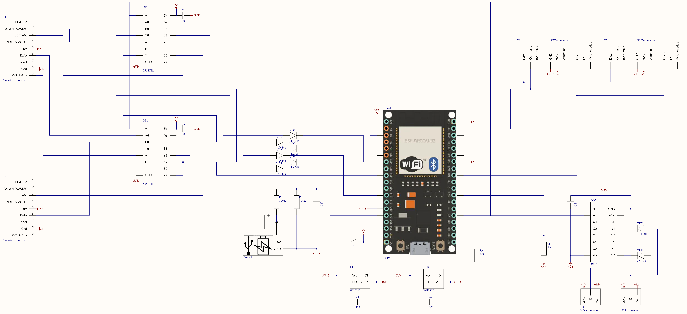

# Wireless-Adapter-for-Retro-Gamepads
Adapter for retro gamepads based on ESP32
* This adapter allows you to connect a gamepad from Sega Genesis/Megadrive, Nintendo 64 and Sony Playstation /2 via Bluetooth.
* The adapter is made for RetroArch and uses the standard layout of the Logitech Rumblepad 2 gamepad.
* Gamepads of each player work simultaneously, their actions add up in most cases.
* Russian-made microchips are used as multiplexers, but they have many analogues.

